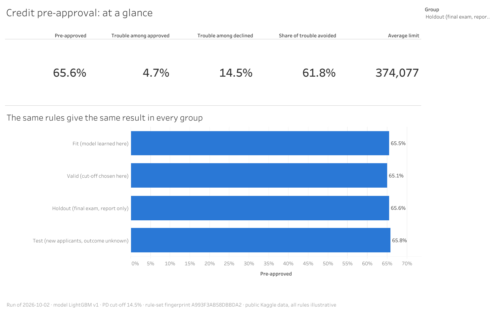
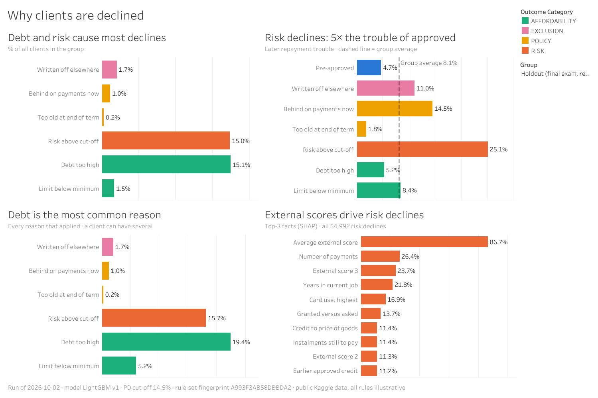
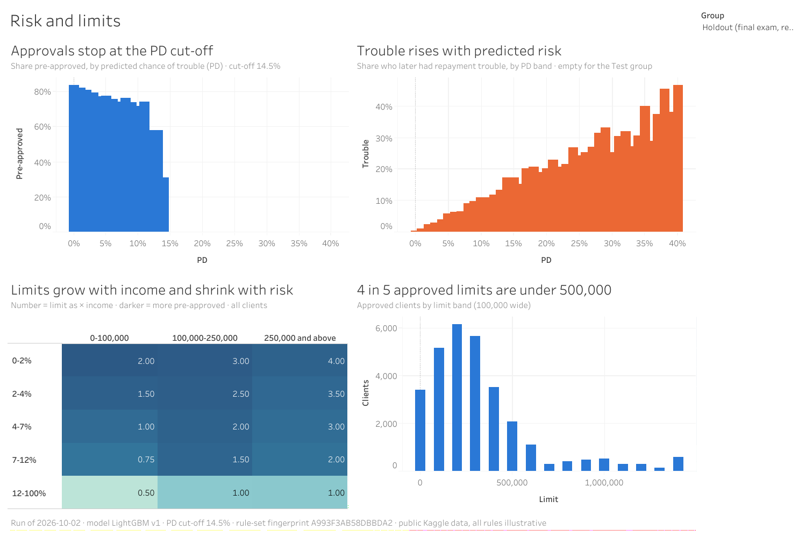
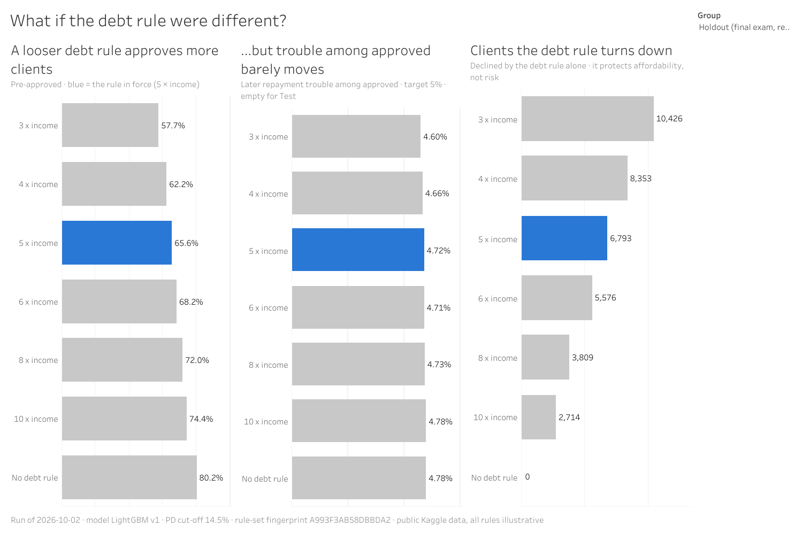

# Credit Pre-Approval Engine

An end-to-end credit pre-approval pipeline built on public data: from raw bureau and
transaction history to a calibrated probability of default, a credit limit and a
reason for every decision.

## In plain words

When someone asks for a loan, the lender has to decide quickly and fairly:
yes or no, how much, and why. This project builds that decision step by step
on public, anonymised data from a consumer lender (Home Credit, published on
Kaggle):

1. **Collect** what is known about each applicant: loans at other lenders,
   earlier applications, how past loans were repaid.
2. **Summarise** it into one row per person — 85 facts such as "share of
   payments made late in the last year".
3. **Estimate** the chance that the person will have trouble repaying.
4. **Decide**: pre-approved or not, up to what limit, and the main reason.

Every step is checked automatically and every choice is written down, so
anyone can follow why the result is what it is. Unfamiliar words are
explained in the [glossary](docs/glossary.md).

> **Status:** ✅ Complete — 58.5M raw rows loaded into Oracle and summarised into an 88-column feature table, checked by 36 automated data-quality checks; LightGBM chosen on untouched clients (Gini 0.572) and calibrated; a decision engine that approves with a limit or declines with reasons, every rule read from tables and 12 checks on every run ([results](docs/decision_engine.md)); every risk decline explained by the three facts that raised the risk most ([examples](docs/risk_factors.md)); the whole pipeline runs with one command ([Stage 5](docs/stage5_design.md)); a four-page dashboard on [Tableau Public](https://public.tableau.com/views/CreditPre-ApprovalEngine/1-Ataglance).

The project also addresses ten engineering problems that are common in legacy
risk pipelines (hard-coded lists, duplicated formulas, rules scattered through
code, silent row duplication and more). See [docs/before_after.md](docs/before_after.md).

## Links

| Platform | What | Link |
|---|---|---|
| GitHub | Code, SQL, documentation | this repository |
| Tableau Public | Dashboard (4 pages) | [Credit Pre-Approval Engine](https://public.tableau.com/views/CreditPre-ApprovalEngine/1-Ataglance) |

## Dashboard

Four pages on [Tableau Public](https://public.tableau.com/views/CreditPre-ApprovalEngine/1-Ataglance); a **Group** selector switches every
chart between the model's groups (holdout, the clients never used for any
choice, is shown by default).

| | |
|---|---|
| [](https://public.tableau.com/views/CreditPre-ApprovalEngine/1-Ataglance) | [](https://public.tableau.com/views/CreditPre-ApprovalEngine/1-Ataglance) |
| **At a glance** — approval, trouble avoided, the same result in every group | **Why declined** — main reasons, trouble per outcome, facts behind risk declines |
| [](https://public.tableau.com/views/CreditPre-ApprovalEngine/1-Ataglance) | [](https://public.tableau.com/views/CreditPre-ApprovalEngine/1-Ataglance) |
| **Risk and limits** — approvals stop at the cut-off, the limit grid | **Debt rule what-if** — the rule protects affordability, not risk |

## Tech stack

Oracle SQL · Python (pandas, scikit-learn, LightGBM, SHAP) · Tableau

## Data

[Home Credit Default Risk](https://www.kaggle.com/competitions/home-credit-default-risk) (Kaggle).
The data is not included in this repository — see [data/README.md](data/README.md).

## Repository structure

```
config/      connection settings template (.env.example)
data/        raw Kaggle files and exports (not committed)
sql/         Oracle scripts, numbered in execution order
python/      reusable modules (hcr/) and runnable scripts
models/      trained models and the one-time holdout result
tableau/     workbook and screenshots
logs/        one log file per pipeline run (not committed)
docs/        glossary, design notes, data profiling, data dictionary, decision log
```

## How to run

All commands are run from the repository root in Windows `cmd`.

1. Download the data (see [data/README.md](data/README.md)) and check it:
   `python python\scripts\check_data.py`
2. Create the database user (once):
   `sqlplus / as sysdba @sql\00_setup\01_create_user.sql`
3. Verify the user:
   `sqlplus / as sysdba @sql\00_setup\02_grant_and_test.sql`
4. Point Oracle at the data folder (once):
   `sqlplus / as sysdba @sql\00_setup\03_create_directory.sql "%CD%\data\raw"`
5. Store the HC password in an Oracle Wallet (once), so no script asks for
   or contains a password: [docs/setup_wallet.md](docs/setup_wallet.md).
   For Python: `python -m pip install -r requirements.txt`, create `config\.env`
   from `config\.env.example`, and store the password once in Windows
   Credential Manager (same document, section "Python")
6. Stage 1 — external tables, raw tables and load:
   `sqlplus /nolog @sql\run_stage1.sql`
7. Check the raw layer at any time:
   `sqlplus /nolog @sql\99_checks\01_raw_overview.sql`
8. Stage 2 — feature tables with data-quality checks, then the data dictionary:
   `sqlplus /nolog @sql\run_stage2.sql`
   (results of every check are stored in the `dq_log` table)
9. Regenerate only [docs/data_dictionary.md](docs/data_dictionary.md):
   `sqlplus /nolog @sql\run_data_dictionary.sql`
10. Stage 3 — check that Python reaches Oracle:
   `python python\scripts\check_db.py`
11. Stage 3 — SQL steps (so far: the fit / valid / holdout split):
   `sqlplus /nolog @sql\run_stage3.sql`
12. Stage 3 — first look at the data (charts in `docs\img`, findings in
   [docs/exploration.md](docs/exploration.md)):
   `python python\scripts\explore.py`
13. Stage 3 — models, the one-time holdout exam, calibration and scores:
   `python python\scripts\train_scorecard.py`,
   `python python\scripts\train_lightgbm.py`,
   `python python\scripts\compare_holdout.py`,
   `python python\scripts\calibrate_and_score.py`, then
   `sqlplus /nolog @sql\99_checks\05_model_scores.sql`
14. Stage 4 — the decision engine: reference tables (rules, reason codes,
   limit grid, exclusion list) and the engine, then the PD cut-off, then
   every client's decision with its limit and reasons, checked automatically:
   `sqlplus /nolog @sql\run_stage4.sql`,
   `python python\scripts\choose_cutoff.py`,
   `sqlplus /nolog @sql\run_decisions.sql`, then the evaluation
   ([docs/decision_engine.md](docs/decision_engine.md)):
   `python python\scripts\evaluate_decisions.py`, and the three facts behind
   each risk decline ([docs/risk_factors.md](docs/risk_factors.md)):
   `python python\scripts\explain_decisions.py`
15. Stage 6 — the dashboard's summary files (reconciled with the engine's run),
   read by Tableau Public ([tableau/README.md](tableau/README.md)):
   `python python\scripts\export_tableau.py`
16. Stage 5 — all of the above in one command, stopping at the first failure
   ([docs/stage5_design.md](docs/stage5_design.md)): the daily steps
   `python python\scripts\run_pipeline.py`, or everything from the raw files
   `python python\scripts\run_pipeline.py --mode full`

## Licence

MIT — see [LICENSE](LICENSE).
