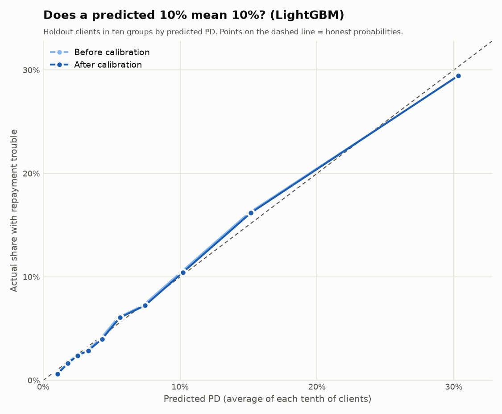

# Calibration (Stage 3g)

_Generated by `python/scripts/calibrate_and_score.py`. Do not edit by hand._

## In plain words

A probability is only useful if it is honest: among clients labelled "10%",
about 10 in 100 should really have repayment trouble. Calibration adjusts each
model's output with two numbers so that this holds. It does not change *who* is
riskier than whom — only how the risk is expressed as a percentage.

## How it is organised (improvement 2)

| What | Where | Why |
|---|---|---|
| The two numbers (a, b) per model version | Oracle table `ref_calibration` | Changing them is a data change, not a code change |
| The formula `1 / (1 + exp(-(a + b × raw score)))` | Oracle function `f_calibrate_pd` — once | No copies that can drift apart |
| Every client's raw score | Oracle table `model_scores` | The PD always follows the current numbers |
| Calibrated PD | Oracle view `v_scores` | One place to read it from |

The numbers are learned on the `valid` clients. `sql/99_checks/05_model_scores.sql`
proves that Oracle's formula and Python give the same PD for every client.

## Results

| Model | a | b | Clients | Actual rate | PD before | PD after | Brier before | Brier after |
|---|---:|---:|---|---:|---:|---:|---:|---:|
| lightgbm | -0.0130 | 0.9860 | valid | 8.24% | 8.13% | 8.24% | 0.06750 | 0.06749 |
| lightgbm | -0.0130 | 0.9860 | holdout | 8.09% | 8.06% | 8.17% | 0.06629 | 0.06628 |
| scorecard | -0.0469 | 0.9693 | valid | 8.24% | 8.11% | 8.24% | 0.07010 | 0.07009 |
| scorecard | -0.0469 | 0.9693 | holdout | 8.09% | 8.03% | 8.16% | 0.06846 | 0.06847 |

`holdout` is reported only; no number was chosen by looking at it.
Brier score: average squared error of the probabilities, lower is better.

## LightGBM, holdout, in ten groups

| Group | Predicted before | Predicted after | Actual |
|---:|---:|---:|---:|
| 1 | 0.99% | 1.05% | 0.63% |
| 2 | 1.73% | 1.81% | 1.64% |
| 3 | 2.41% | 2.50% | 2.40% |
| 4 | 3.18% | 3.29% | 2.87% |
| 5 | 4.17% | 4.29% | 3.99% |
| 6 | 5.46% | 5.60% | 6.07% |
| 7 | 7.28% | 7.43% | 7.23% |
| 8 | 10.04% | 10.20% | 10.43% |
| 9 | 15.03% | 15.18% | 16.20% |
| 10 | 30.36% | 30.32% | 29.45% |
