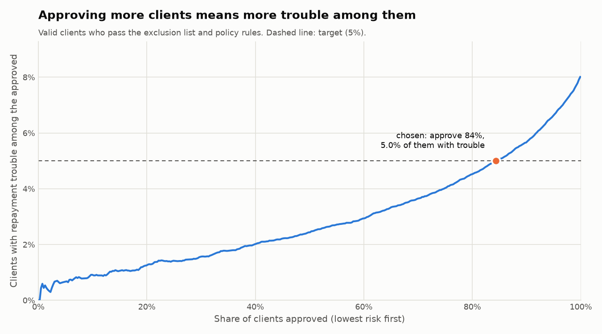

# PD cut-off (Stage 4b)

_Generated by `python/scripts/choose_cutoff.py`. Do not edit by hand._

## In plain words

A lender can approve more clients or fewer. More approvals mean more business,
but also more clients who later have trouble repaying. The rule agreed in
advance ([decision 25](decisions.md)): approve as many clients as possible while at most
**5%** of the approved are expected to have repayment trouble.

**Chosen cut-off: PD 14.50%** — a client whose calibrated PD is at or below this
passes the risk step. The value is stored in `ref_rules` as `PD_CUTOFF`, not in code.

## Result

Among clients who pass the exclusion list and the policy rules:

| Clients | Approved | Trouble among approved | Trouble among declined | Share of all trouble avoided |
|---|---:|---:|---:|---:|
| valid (choice made here) | 84.4% | 5.00% | 24.69% | 47.8% |
| holdout (report only) | 84.6% | 4.87% | 25.08% | 48.4% |

## The trade-off

Other choices a lender could make, on the same `valid` clients:

| Approve | Cut-off PD | Trouble among approved | Share of all trouble avoided |
|---:|---:|---:|---:|
| 50% | 4.87% | 2.44% | 84.9% |
| 60% | 6.37% | 2.94% | 78.2% |
| 70% | 8.63% | 3.65% | 68.4% |
| 80% | 12.17% | 4.52% | 55.2% |
| 85% | 14.91% | 5.05% | 46.8% |
| 90% | 19.27% | 5.67% | 36.9% |
| 95% | 27.02% | 6.63% | 22.0% |
| 100% | 78.60% | 8.08% | 0.0% |
