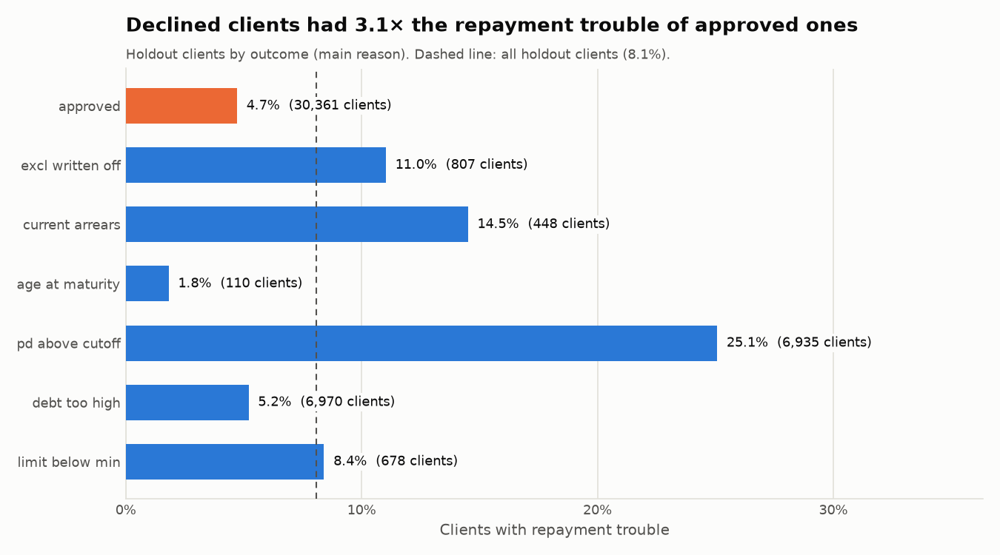
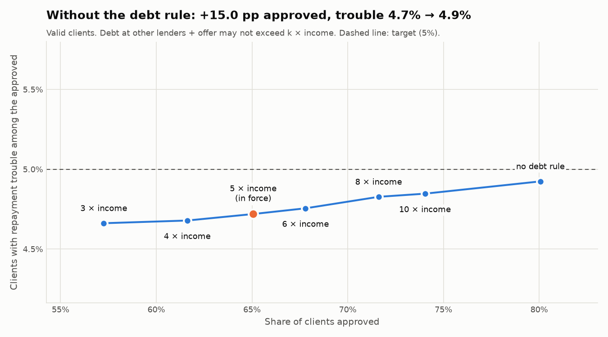

# The decision engine: results (Stage 4d)

_Generated by `python/scripts/evaluate_decisions.py`. Do not edit by hand._

## In plain words

Every client was approved with a limit or declined with reasons by one procedure,
`p_run_decisions`, which reads all its rules from tables ([stage4_design.md](stage4_design.md)).
For clients whose outcome is known we can check whether the decisions were sensible:
**4.7%** of the approved holdout clients had repayment trouble, against
**14.5%** of the declined ones. Declining 34.4% of the clients
avoided **61.8%** of all repayment trouble.

## Which run

| Run | Date | Model | PD cut-off | Rule-set fingerprint | Clients | Approved |
|---|---|---|---:|---|---:|---:|
| 2 | 2026-09-26 | lightgbm v1 | 14.50% | `A993F3AB58DBBDA2` | 356,255 | 233,377 |

Python recomputed every decision and limit from the same rules: all of them match the
engine's (reconciliation, [improvement 10](before_after.md)).

## Results by group of clients

| Group | Clients | Approved | Trouble among approved | Expected trouble (average PD) | Trouble among declined | Trouble avoided | Average limit |
|---|---:|---:|---:|---:|---:|---:|---:|
| valid (cut-off chosen here) | 46,342 | 65.1% | 4.72% | 4.77% | 14.79% | 62.7% | 374,601 |
| holdout (report only) | 46,309 | 65.6% | 4.72% | 4.75% | 14.52% | 61.8% | 374,077 |
| test (outcome unknown) | 48,744 | 65.8% | – | 4.67% | – | – | 397,383 |

The cut-off was chosen so that at most 5% of approved `valid` clients have trouble ([cutoff.md](cutoff.md));
the other rules decline some more clients after it. For the test clients the outcome is
unknown, so only the model's expectation can be shown.

## Is each rule declining riskier clients?

| Outcome (main reason) | Meaning | Clients | Share | Trouble | Average PD |
|---|---|---:|---:|---:|---:|
| `APPROVED` | Pre-approved | 30,361 | 65.6% | 4.72% | 4.75% |
| `EXCL_WRITTEN_OFF` | A credit at another lender was written off or sold to a debt collector. | 807 | 1.7% | 11.03% | 9.57% |
| `CURRENT_ARREARS` | Currently behind on a payment at another lender. | 448 | 1.0% | 14.51% | 14.45% |
| `AGE_AT_MATURITY` | Would be above the maximum age at the end of the offered term. | 110 | 0.2% | 1.82% | 2.37% |
| `PD_ABOVE_CUTOFF` | Estimated chance of repayment trouble is above the accepted level. | 6,935 | 15.0% | 25.08% | 25.27% |
| `DEBT_TOO_HIGH` | Existing debt leaves no room for an offer of the minimum size. | 6,970 | 15.1% | 5.21% | 5.36% |
| `LIMIT_BELOW_MIN` | The limit allowed for this income and risk level is below the minimum offer size. | 678 | 1.5% | 8.41% | 10.42% |
| all holdout clients | | 46,309 | 100.0% | 8.09% | |

Clients declined **only** by the debt rule: 6,793, of whom 5.06% had trouble —
about as risky as the approved clients, so the rule mainly limits exposure, not risk.

## The debt rule at other values (decision aid)

The rule in force: active debt at other lenders plus the offer may not exceed **5 × income** (`MAX_TOTAL_DEBT_TO_INCOME`, an illustrative choice).
Below, the same `valid` clients with other values; every other rule is unchanged.
**Nothing is changed in `ref_rules`**: a new value would be a new, dated row, decided by a person.

| Debt rule | Approved | Trouble among approved | Declined by the debt rule | Average limit |
|---|---:|---:|---:|---:|
| 3 × income | 57.3% | 4.66% | 10,569 | 338,282 |
| 4 × income | 61.6% | 4.68% | 8,549 | 364,979 |
| **5 × income (in force)** | 65.1% | 4.72% | 6,952 | 374,601 |
| 6 × income | 67.8% | 4.76% | 5,686 | 380,560 |
| 8 × income | 71.6% | 4.83% | 3,917 | 388,225 |
| 10 × income | 74.0% | 4.85% | 2,794 | 392,441 |
| no debt rule | 80.1% | 4.92% | 0 | 402,257 |

## Things to watch

| Model | Average PD, holdout | Actual, holdout | Average PD, test |
|---|---:|---:|---:|
| lightgbm | 8.17% | 8.09% | 7.61% |
| scorecard | 8.16% | 8.09% | 8.23% |

On the holdout, each model's average PD is within 0.08 percentage points of the actual rate.
On the test clients the two models' averages differ by 0.62 points, and the
outcome is unknown, so nobody can yet say which is closer. In live use this is what monitoring is for:
once outcomes arrive, compare them with the expectation, and recalibrate if they drift apart.
