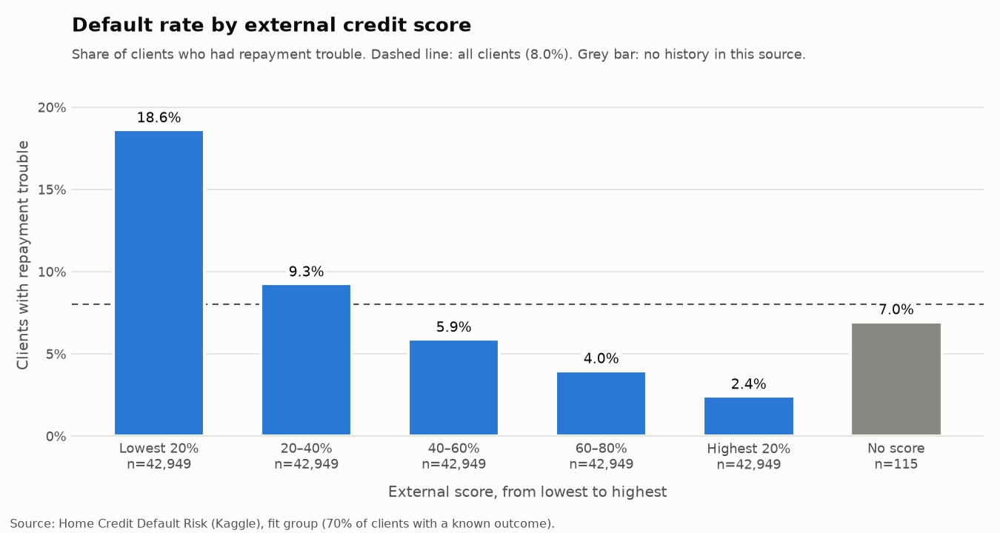
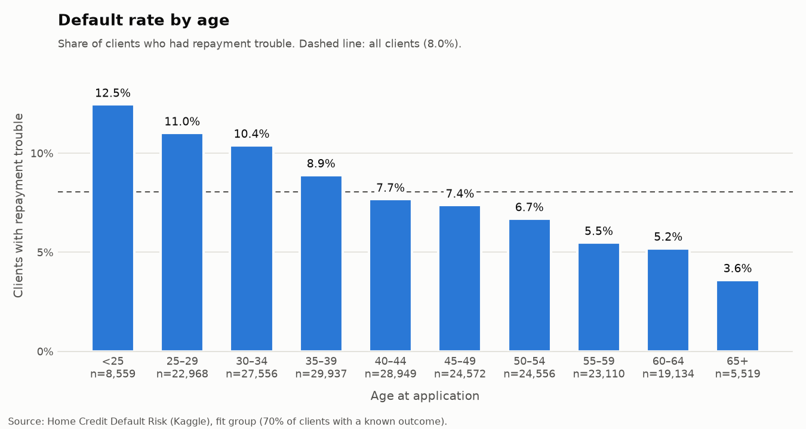
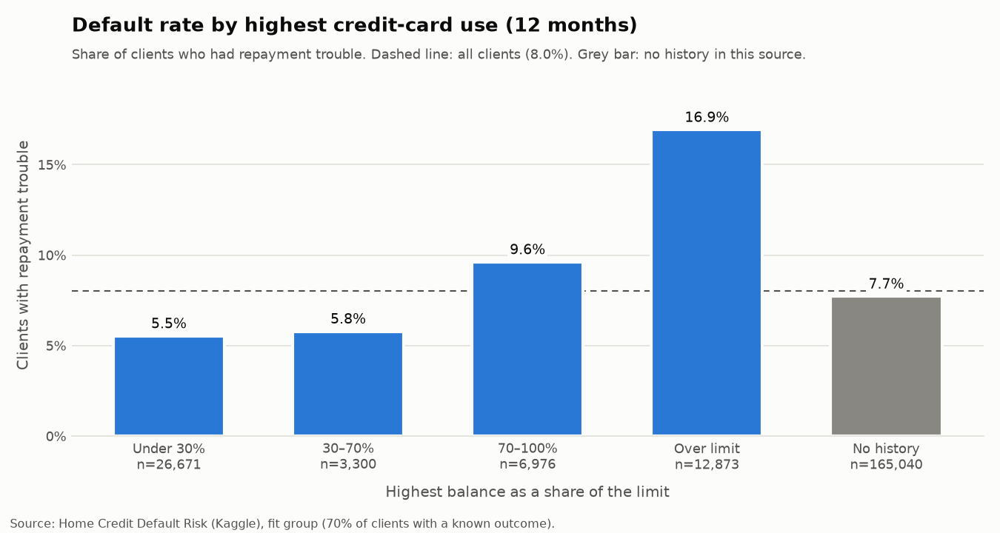
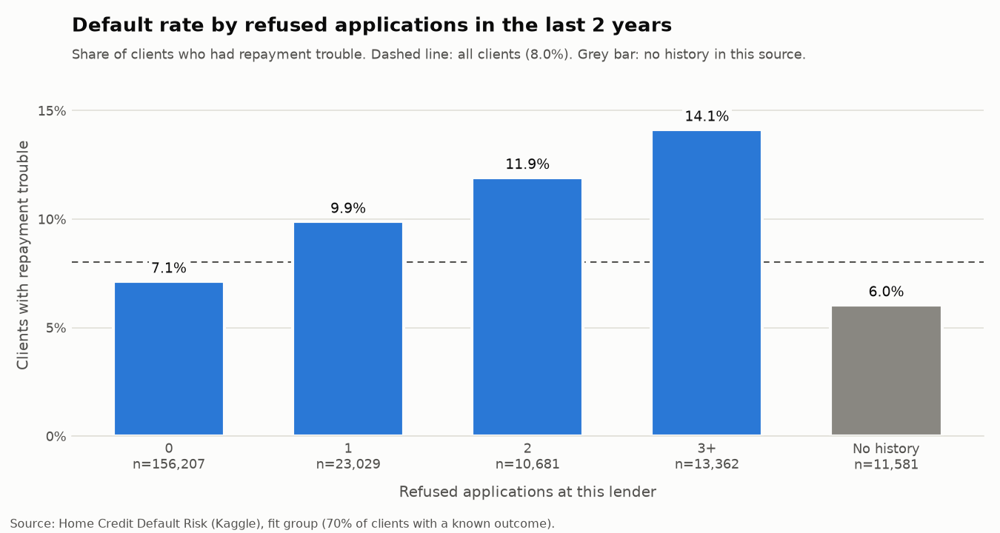
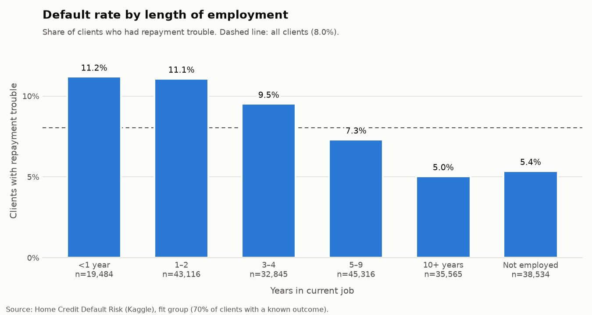
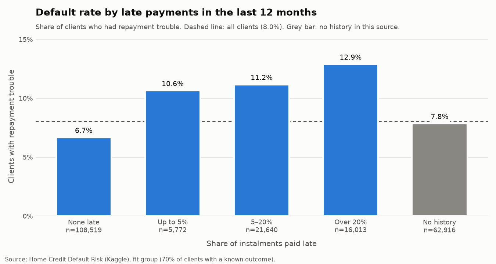
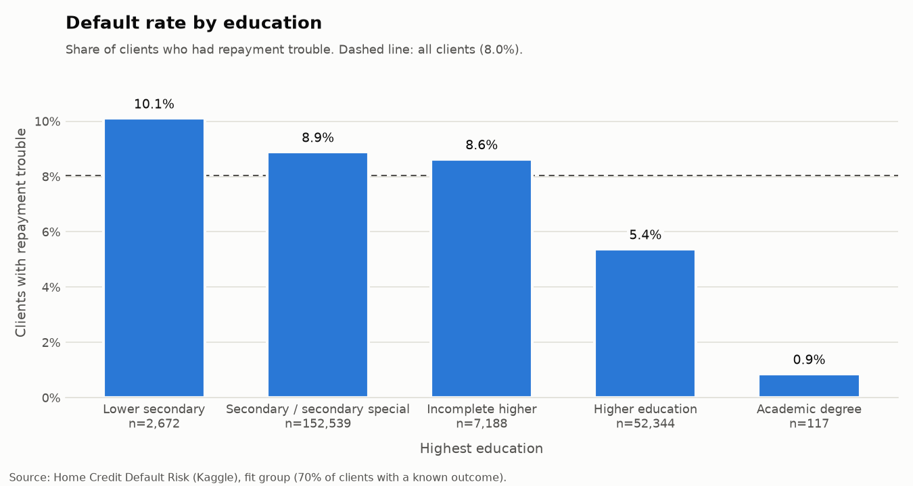
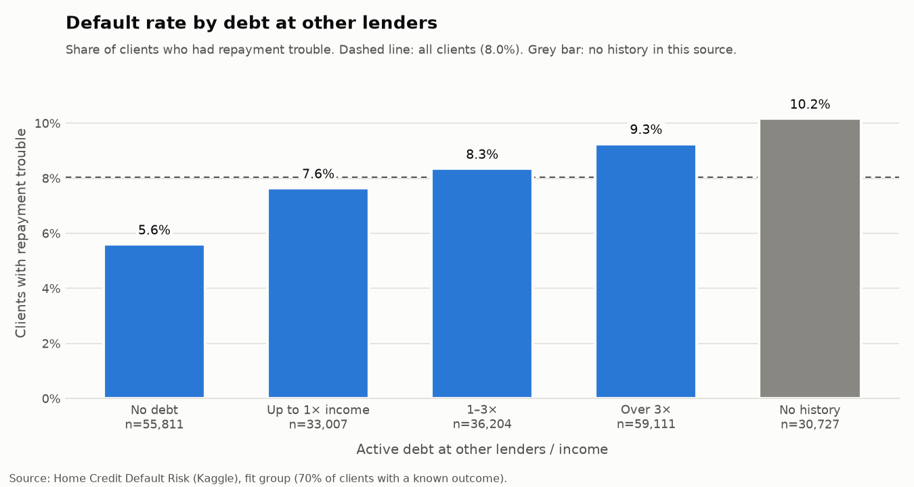
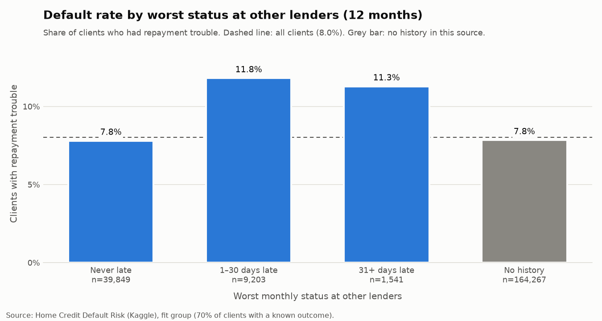

# First look at the data (Stage 3c)

## In plain words

Before building a model, we looked at the data the way a person would: split
clients into simple groups — by age, by late payments, by credit-card use —
and compared how often each group had trouble repaying.

On average, **8 in 100** clients had repayment trouble. Some groups are far
above that, some far below. The bigger the gap between groups, the more a
fact tells us about risk — and the more the model will rely on it.

Charts and numbers come from
[`python/scripts/explore.py`](../python/scripts/explore.py). Only the `fit`
group is used (214,860 clients, 70% of those with a known outcome), so the
clients the model will be tested on stay unseen.

## Summary: which facts separate risky from safe clients?

Ratio = default rate of the riskiest group ÷ default rate of the safest group
(groups with at least 500 clients).

| Fact | Safest group | Riskiest group | Ratio |
|---|---|---|---:|
| External credit score | highest 20%: 2.4% | lowest 20%: 18.6% | **7.7×** |
| Age | 65+: 3.6% | under 25: 12.5% | **3.4×** |
| Highest credit-card use | under 30% of limit: 5.5% | over the limit: 16.9% | **3.1×** |
| Refused applications (2 years) | no earlier applications: 6.0% | 3 or more refusals: 14.1% | 2.3× |
| Length of employment | 10+ years: 5.0% | under 1 year: 11.2% | 2.2× |
| Late payments (12 months) | none late: 6.7% | over 20% late: 12.9% | 1.9× |
| Education | higher education: 5.4% | lower secondary: 10.1% | 1.9× |
| Debt at other lenders / income | no active debt: 5.6% | no bureau history: 10.2% | 1.8× |
| Worst status at other lenders | never late: 7.8% | 1–30 days late: 11.8% | 1.5× |

## Three things worth knowing

**1. "No history" is not neutral — and it means different things in
different places.** Clients with *no credit history at other lenders* default
more often than average (10.2%), while clients with *no earlier applications
at this lender* default less often (6.0%). An unknown is information in its
own right. This is why every feature table has a `*_has_history` flag, and why
the scorecard will give "no history" its own group instead of treating it as
zero.

**2. Behaviour speaks louder than profile.** Going over a credit-card limit
triples the risk (16.9% vs 5.5%); several recent refusals double it. These are
things the client *did*, and they separate risk as well as — or better than —
who the client *is*.

**3. Facts overlap.** Older clients have longer jobs; pensioners are both
older and "not employed" (their 5.4% default rate matches the data profiling,
[decision 9](decisions.md)). One chart at a time cannot tell which fact really
matters; the model weighs them together. These charts show *where to look*, not
the final answer.

## The charts

### External credit score — the strongest single signal

A score from outside sources (Kaggle does not say which). The lowest fifth of
clients default almost 8 times as often as the highest fifth.

### Age — risk falls steadily with age

From 12.5% under 25 to 3.6% at 65+, with no reversal: older applicants are
*safer* here. The scorecard in the end did not use age at all — its
information is carried by other facts — and any age limit a lender wants is
kept as a separate, visible policy rule ([decision 20](decisions.md)).

### Credit-card use — going over the limit is a warning sign

Using up to 70% of the limit looks safe; over the limit, risk triples.
77% of clients had no card at this lender (grey bar).

### Refused applications in the last two years

Each refusal raises the risk: 7.1% with none, 14.1% with three or more.

### Length of employment

The longer in the current job, the safer. "Not employed" (5.4%) is mostly
pensioners, who are among the safest clients.

### Late payments on earlier loans (last 12 months)

Even a few late payments matter: any lateness lifts the rate from 6.7% to
above 10%.

### Education

Higher education: 5.4%; secondary: 8.9%. The "academic degree" group is too
small (117 clients) to draw conclusions from.

### Debt at other lenders compared with income

More debt relative to income, more risk (5.6% → 9.3%). The riskiest group is
the one with *no* bureau history at all (10.2%).

### Worst status at other lenders (last 12 months)

Any recent lateness elsewhere lifts the rate from 7.8% to about 11.5%. Only
23% of clients have this monthly history, so the effect on the whole
portfolio is limited.
