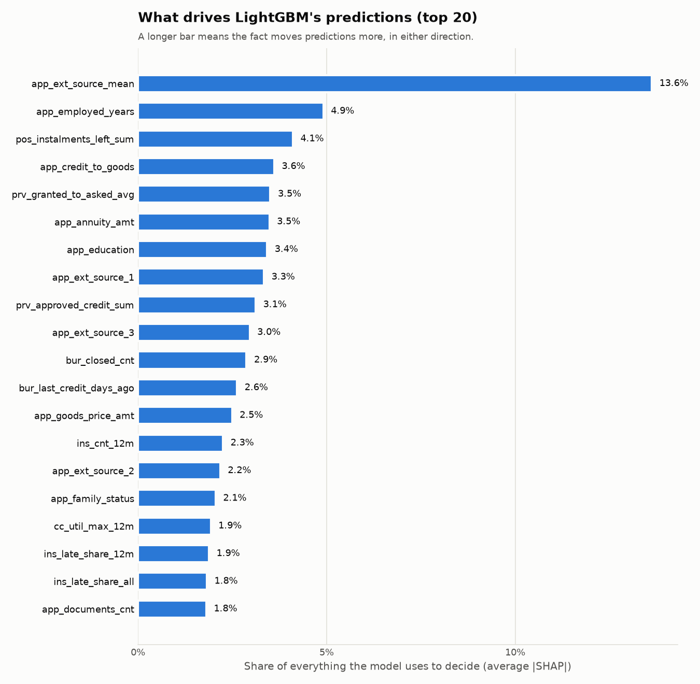

# LightGBM (Stage 3e)

_Generated by `python/scripts/train_lightgbm.py`. Do not edit by hand._

## In plain words

LightGBM builds many small yes/no decision trees, each fixing the mistakes of
the previous ones. It can find patterns a points table cannot, but it is
harder to explain — so we measure what each fact contributes and compare it
with the [scorecard](scorecard.md) on the same clients neither model learned from.

## How well it works

| Model | Gini on `fit` | Gini on `valid` |
|---|---:|---:|
| Scorecard | 0.502 | 0.490 |
| LightGBM (1196 trees) | 0.659 | 0.558 |

Gain on `valid`: **+0.068**. The scorecard is preferred unless LightGBM gains
at least 0.02 ([decision 16](decisions.md)); the final comparison uses the
untouched `holdout` clients (Stage 3f).

A higher Gini on `fit` than on `valid` is expected: `fit` are the clients the
model learned from. What matters is `valid`, which played no part in training.

## How the settings were chosen

Five-fold cross-validation inside `fit`: learn on 4/5 of the fit clients, test on
the remaining 1/5, five times over. Only these 6 settings were tried, declared in
advance; the number of trees is where the cross-validated result stopped improving.

| num_leaves | min_child_samples | Trees | CV Gini |
|---:|---:|---:|---:|
| 15 | 100 | 1132 | 0.556 (± 0.007) |
| 15 | 400 | 1196 | 0.558 (± 0.007) ← chosen |
| 31 | 100 | 889 | 0.555 (± 0.007) |
| 31 | 400 | 704 | 0.557 (± 0.007) |
| 63 | 100 | 420 | 0.555 (± 0.007) |
| 63 | 400 | 487 | 0.556 (± 0.007) |

Chosen: 1196 trees, 288 seconds in total. Other settings are fixed and
listed in `models/lightgbm.json`. Age is not a feature ([decision 21](decisions.md)).

## What drives the predictions

Measured with SHAP on 20,000 `valid` clients: for every client, how much each
fact pushed the prediction up or down; the chart shows each fact's share of the total.

| Fact | Share |
|---|---:|
| `app_ext_source_mean` | 13.6% |
| `app_employed_years` | 4.9% |
| `pos_instalments_left_sum` | 4.1% |
| `app_credit_to_goods` | 3.6% |
| `prv_granted_to_asked_avg` | 3.5% |
| `app_annuity_amt` | 3.5% |
| `app_education` | 3.4% |
| `app_ext_source_1` | 3.3% |
| `prv_approved_credit_sum` | 3.1% |
| `app_ext_source_3` | 3.0% |
| `bur_closed_cnt` | 2.9% |
| `bur_last_credit_days_ago` | 2.6% |
| `app_goods_price_amt` | 2.5% |
| `ins_cnt_12m` | 2.3% |
| `app_ext_source_2` | 2.2% |
| `app_family_status` | 2.1% |
| `cc_util_max_12m` | 1.9% |
| `ins_late_share_12m` | 1.9% |
| `ins_late_share_all` | 1.8% |
| `app_documents_cnt` | 1.8% |
