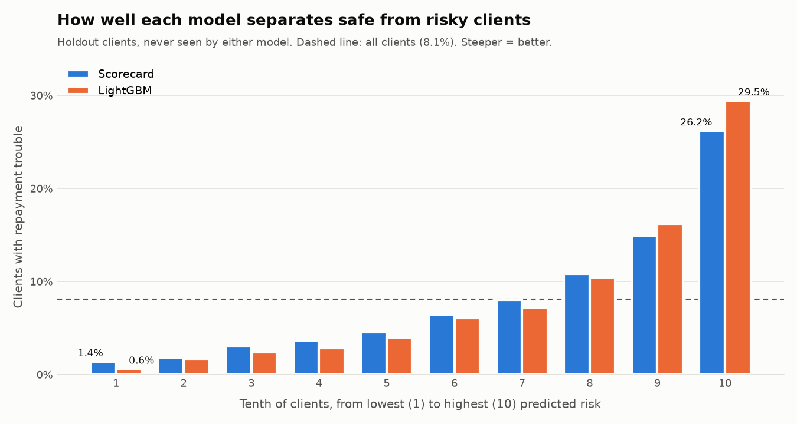

# Final comparison on the holdout (Stage 3f)

_Generated by `python/scripts/compare_holdout.py`. Do not edit by hand._

## In plain words

46,309 clients were kept aside from the start and never shown to
either model. Both models were tested on them once, and the winner was picked by
a rule written down before the test ([decision 16](decisions.md)).

**Winner: LightGBM.**

Among the 10% of clients LightGBM rates safest, 0.6% had repayment
trouble; among the 10% it rates riskiest, 29.5% did (all clients: 8.1%).

## Results

| Model | Gini | KS | Brier | Average predicted PD | Stability vs new applicants (PSI) |
|---|---:|---:|---:|---:|---:|
| Scorecard | 0.504 | 0.377 | 0.0685 | 8.03% | 0.005 |
| LightGBM | 0.572 | 0.433 | 0.0663 | 8.06% | 0.004 |

Actual default rate on the holdout: 8.09%.

**Gini gain of LightGBM: +0.069** (95% interval +0.060 to +0.076, from 500
bootstrap re-draws of the holdout). The rule needs at least +0.020.

PSI below 0.1 means the new applicants (Kaggle's test clients) look like the
clients the models were tested on, so the results should carry over.

## Calibration: predicted vs actual

Clients sorted by predicted PD into ten equal groups. Close numbers mean the
probabilities can be taken at face value; any gap is corrected in Stage 3g.

| Group | Scorecard predicted | Scorecard actual | LightGBM predicted | LightGBM actual |
|---:|---:|---:|---:|---:|
| 1 | 1.36% | 1.43% | 0.99% | 0.63% |
| 2 | 2.17% | 1.86% | 1.73% | 1.64% |
| 3 | 2.90% | 3.02% | 2.41% | 2.40% |
| 4 | 3.75% | 3.67% | 3.18% | 2.87% |
| 5 | 4.75% | 4.56% | 4.17% | 3.99% |
| 6 | 6.06% | 6.44% | 5.46% | 6.07% |
| 7 | 7.84% | 8.01% | 7.28% | 7.23% |
| 8 | 10.48% | 10.80% | 10.04% | 10.43% |
| 9 | 14.94% | 14.92% | 15.03% | 16.20% |
| 10 | 26.09% | 26.21% | 30.36% | 29.45% |

## Integrity

The exam is recorded in `models/holdout_result.json` together with a SHA-256
fingerprint of both model files. The script refuses to re-run the holdout on
changed models.
