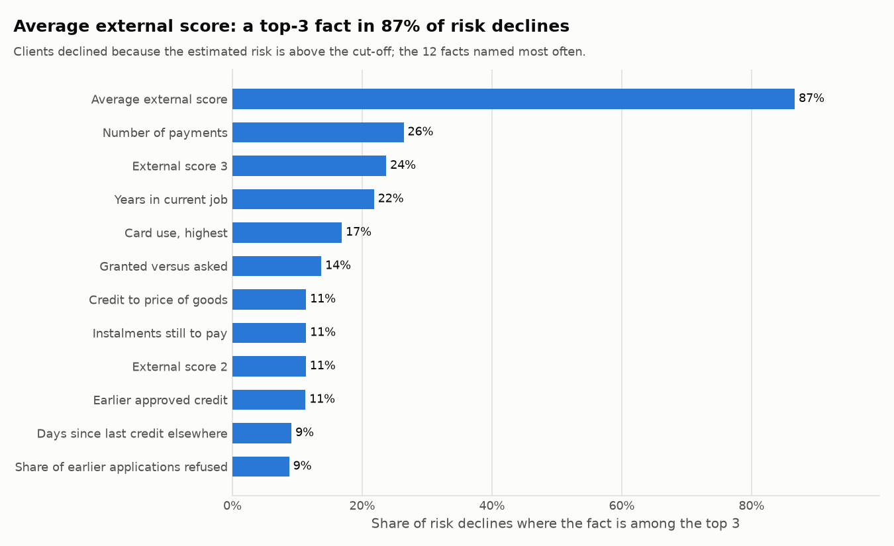

# Why the risk is high: three facts per client (Stage 4e)

_Generated by `python/scripts/explain_decisions.py`. Do not edit by hand._

## In plain words

"Your estimated risk is above our limit" is a reason, but not an explanation. For every
client declined for risk, the model is asked which of the client's facts raised the
estimated risk most **compared with an average client** (SHAP values). The top three are
stored with the decision as sentences a client can read, for example:

> 1. Average external credit score: 0.41 (0 = worst, 1 = best)  
> 2. The loan runs for about 13 regular payments  
> 3. 67% of earlier applications were refused

The sentences come from the table `ref_feature_text` (one per model feature), so a wording
is improved by editing a row, not code. Only facts that *raised* the risk are named.

## Which run

| Run | Date | Model | Clients declined for risk | Explained | Largest SHAP reconciliation gap |
|---|---|---|---:|---:|---:|
| 21 | 2026-10-02 | lightgbm v1 | 54,992 | 54,992 | 1.6e-14 |

For every client the SHAP parts add up to the raw score stored in `model_scores`: the
explanation comes from exactly the model that made the decision.

## The facts named most often

| Fact | Among the top 3 | Named first |
|---|---:|---:|
| Average external score | 86.7% | 76.9% |
| Number of payments | 26.4% | 2.7% |
| External score 3 | 23.7% | 0.5% |
| Years in current job | 21.8% | 1.3% |
| Card use, highest | 16.9% | 4.9% |
| Granted versus asked | 13.7% | 1.1% |
| Credit to price of goods | 11.4% | 1.0% |
| Instalments still to pay | 11.4% | 4.0% |
| External score 2 | 11.3% | 0.2% |
| Earlier approved credit | 11.2% | 1.1% |
| Days since last credit elsewhere | 9.1% | 0.8% |
| Share of earlier applications refused | 8.7% | 0.5% |
| Card spending | 6.7% | 1.4% |
| Longest delay, last year | 6.5% | 1.4% |
| External score 1 | 5.6% | 0.1% |

## Three examples (test clients, chosen at random)

**Client 285282** — PD 21.5%, main reason `PD_ABOVE_CUTOFF`

1. Average external credit score: 0.41 (0 = worst, 1 = best)
2. The loan runs for about 13 regular payments
3. 67% of earlier applications were refused

**Client 392270** — PD 31.9%, main reason `PD_ABOVE_CUTOFF`

1. Average external credit score: 0.28 (0 = worst, 1 = best)
2. On earlier approvals, received on average 122% of the amount asked
3. 50% of earlier applications were refused

**Client 384155** — PD 17.4%, main reason `EXCL_WRITTEN_OFF`

1. Average external credit score: 0.39 (0 = worst, 1 = best)
2. The loan runs for about 13 regular payments
3. In the current job for 0.6 years

## To review: facts about personal circumstances

Some facts describe a person's circumstances rather than how they handled credit:
education, family status, children, family size, income type, not being employed.
One of them is among the top 3 for **0.4%** of risk declines and named first for
**0.0%**. The model uses them like any other fact (only gender is excluded,
[decision 13](decisions.md)). Whether a lender may use them, and name them to a client, is a
question for its compliance team; these numbers show how much the answer would matter.
