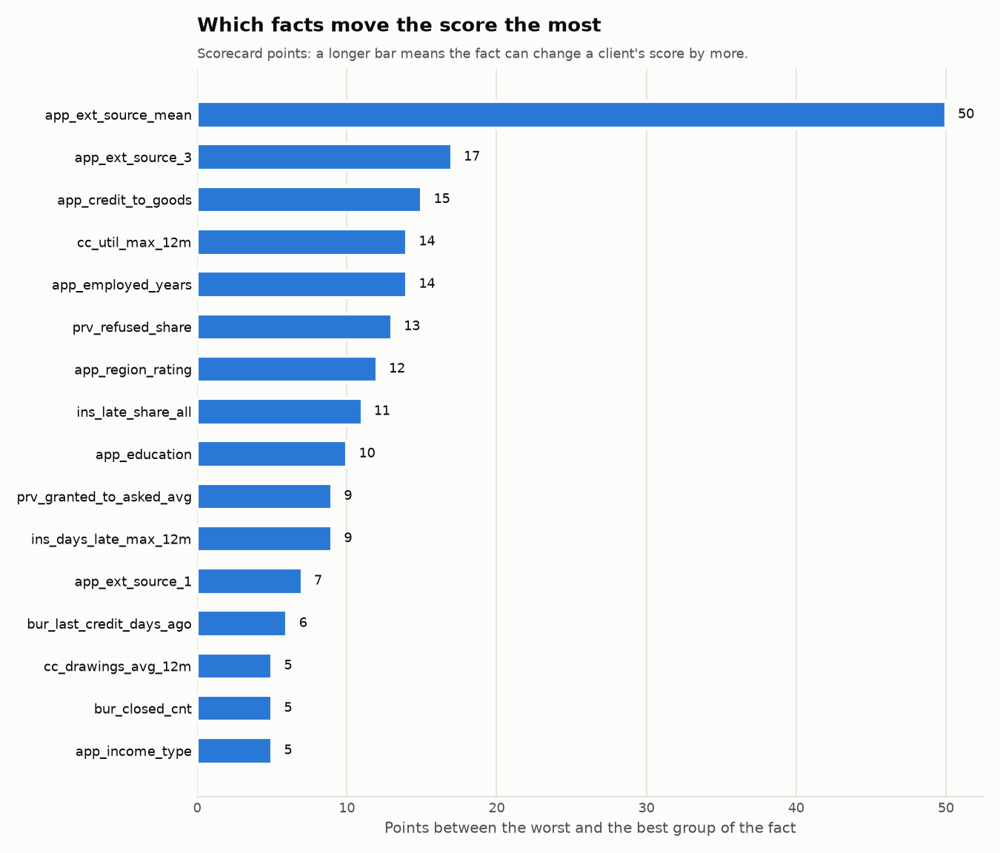

# Scorecard (Stage 3d)

_Generated by `python/scripts/train_scorecard.py`. Do not edit by hand._

## In plain words

Each fact about a client falls into one group, and each group is worth a
number of points. Add up the points: **the higher the total, the safer the
client**. Every 20 extra points halve the odds of repayment trouble.

The points were learned from 70% of the clients with a known outcome and
checked on another 15% the model had never seen.

## How well it works

| Clients | Number | Gini | KS |
|---|---:|---:|---:|
| fit | 214,860 | 0.502 | 0.378 |
| valid | 46,342 | 0.490 | 0.370 |

Gini: 0 = no better than a coin toss, 1 = perfect ranking. A similar value on
`fit` and `valid` means the scorecard learned general patterns rather than
memorising the training clients. See the [glossary](glossary.md).

## The points

Column names are explained in the [data dictionary](data_dictionary.md).

### `app_ext_source_mean` (IV 0.607)

| Group | Clients | Share | Default rate | Points |
|---|---:|---:|---:|---:|
| < 0.3043 | 21,474 | 10.0% | 22.73% | 12 |
| 0.3043 to < 0.3848 | 21,474 | 10.0% | 14.52% | 22 |
| 0.3848 to < 0.4398 | 21,475 | 10.0% | 10.54% | 29 |
| 0.4398 to < 0.4845 | 21,474 | 10.0% | 7.97% | 35 |
| 0.4845 to < 0.5248 | 21,475 | 10.0% | 6.37% | 40 |
| 0.5248 to < 0.5638 | 21,474 | 10.0% | 5.42% | 43 |
| 0.5638 to < 0.6026 | 21,474 | 10.0% | 4.17% | 48 |
| 0.6026 to < 0.6442 | 21,475 | 10.0% | 3.79% | 50 |
| 0.6442 to < 0.6928 | 21,474 | 10.0% | 2.81% | 56 |
| >= 0.6928 | 21,476 | 10.0% | 2.03% | 62 |
| Missing | 115 | 0.1% | 6.96% | 37 |

### `app_ext_source_3` (IV 0.332)

| Group | Clients | Share | Default rate | Points |
|---|---:|---:|---:|---:|
| < 0.2289 | 17,181 | 8.0% | 20.09% | 26 |
| 0.2289 to < 0.3313 | 17,202 | 8.0% | 12.64% | 31 |
| 0.3313 to < 0.4084 | 17,018 | 7.9% | 9.41% | 33 |
| 0.4084 to < 0.4758 | 17,274 | 8.0% | 8.05% | 35 |
| 0.4758 to < 0.5371 | 17,404 | 8.1% | 6.08% | 37 |
| 0.5371 to < 0.592 | 17,112 | 8.0% | 5.27% | 39 |
| 0.592 to < 0.643 | 17,117 | 8.0% | 4.83% | 39 |
| 0.643 to < 0.6941 | 17,125 | 8.0% | 4.25% | 41 |
| 0.6941 to < 0.7504 | 17,473 | 8.1% | 3.43% | 42 |
| >= 0.7504 | 17,284 | 8.0% | 3.27% | 43 |
| Missing | 42,670 | 19.9% | 9.30% | 33 |

### `app_ext_source_1` (IV 0.142)

| Group | Clients | Share | Default rate | Points |
|---|---:|---:|---:|---:|
| < 0.2966 | 18,760 | 8.7% | 14.45% | 32 |
| 0.2966 to < 0.4382 | 18,759 | 8.7% | 8.73% | 34 |
| 0.4382 to < 0.5733 | 18,761 | 8.7% | 6.44% | 36 |
| 0.5733 to < 0.7101 | 18,760 | 8.7% | 4.71% | 37 |
| >= 0.7101 | 18,762 | 8.7% | 2.97% | 39 |
| Missing | 121,058 | 56.3% | 8.48% | 35 |

### `app_employed_years` (IV 0.116)

| Group | Clients | Share | Default rate | Points |
|---|---:|---:|---:|---:|
| < 1.69 | 35,213 | 16.4% | 11.29% | 30 |
| 1.69 to < 2.51 | 17,478 | 8.1% | 11.15% | 30 |
| 2.51 to < 3.41 | 17,704 | 8.2% | 10.37% | 31 |
| 3.41 to < 4.51 | 17,682 | 8.2% | 9.40% | 32 |
| 4.51 to < 5.9 | 17,686 | 8.2% | 8.46% | 34 |
| 5.9 to < 7.63 | 17,642 | 8.2% | 7.45% | 36 |
| 7.63 to < 10.05 | 17,646 | 8.2% | 6.69% | 38 |
| 10.05 to < 14.59 | 17,634 | 8.2% | 5.61% | 40 |
| >= 14.59 | 17,641 | 8.2% | 4.47% | 44 |
| Missing | 38,534 | 17.9% | 5.37% | 41 |

### `bur_last_credit_days_ago` (IV 0.080)

| Group | Clients | Share | Default rate | Points |
|---|---:|---:|---:|---:|
| < 67 | 18,265 | 8.5% | 12.40% | 32 |
| 67 to < 118 | 18,526 | 8.6% | 9.27% | 34 |
| 118 to < 229 | 36,591 | 17.0% | 8.78% | 34 |
| 229 to < 301 | 18,539 | 8.6% | 7.55% | 35 |
| 301 to < 391 | 18,480 | 8.6% | 6.98% | 36 |
| 391 to < 525 | 18,438 | 8.6% | 6.21% | 37 |
| 525 to < 746 | 18,409 | 8.6% | 5.94% | 37 |
| >= 746 | 36,885 | 17.2% | 5.46% | 38 |
| Missing | 30,727 | 14.3% | 10.17% | 33 |

### `cc_util_max_12m` (IV 0.075)

| Group | Clients | Share | Default rate | Points |
|---|---:|---:|---:|---:|
| < 0.9705 | 34,873 | 16.2% | 6.03% | 39 |
| >= 0.9705 | 14,947 | 7.0% | 16.15% | 25 |
| Missing | 165,040 | 76.8% | 7.72% | 35 |

### `app_credit_to_goods` (IV 0.074)

| Group | Clients | Share | Default rate | Points |
|---|---:|---:|---:|---:|
| < 1.079 | 85,850 | 40.0% | 6.39% | 40 |
| 1.079 to < 1.145 | 41,931 | 19.5% | 6.85% | 38 |
| 1.145 to < 1.168 | 22,484 | 10.5% | 8.45% | 34 |
| 1.168 to < 1.211 | 20,618 | 9.6% | 8.90% | 33 |
| 1.211 to < 1.277 | 22,110 | 10.3% | 11.01% | 28 |
| >= 1.277 | 21,673 | 10.1% | 12.56% | 25 |
| Missing | 194 | 0.1% | 8.76% | 33 |

### `prv_refused_share` (IV 0.069)

| Group | Clients | Share | Default rate | Points |
|---|---:|---:|---:|---:|
| < 0.1333 | 142,273 | 66.2% | 7.05% | 37 |
| 0.1333 to < 0.25 | 17,712 | 8.2% | 8.04% | 35 |
| 0.25 to < 0.4 | 22,617 | 10.5% | 9.97% | 31 |
| >= 0.4 | 20,677 | 9.6% | 13.81% | 26 |
| Missing | 11,581 | 5.4% | 6.04% | 39 |

### `ins_days_late_max_12m` (IV 0.067)

| Group | Clients | Share | Default rate | Points |
|---|---:|---:|---:|---:|
| < 2 | 117,460 | 54.7% | 6.87% | 37 |
| 2 to < 5 | 16,596 | 7.7% | 10.12% | 32 |
| >= 5 | 17,868 | 8.3% | 14.36% | 28 |
| Missing | 62,936 | 29.3% | 7.85% | 35 |

### `ins_late_share_all` (IV 0.060)

| Group | Clients | Share | Default rate | Points |
|---|---:|---:|---:|---:|
| < 0.01852 | 101,745 | 47.4% | 6.70% | 37 |
| 0.01852 to < 0.04878 | 20,314 | 9.5% | 7.24% | 36 |
| 0.04878 to < 0.08929 | 20,512 | 9.5% | 8.69% | 34 |
| 0.08929 to < 0.1538 | 20,378 | 9.5% | 9.43% | 33 |
| 0.1538 to < 0.2647 | 20,395 | 9.5% | 10.11% | 31 |
| >= 0.2647 | 20,380 | 9.5% | 12.42% | 28 |
| Missing | 11,136 | 5.2% | 6.03% | 39 |

### `app_income_type` (IV 0.056)

| Group | Clients | Share | Default rate | Points |
|---|---:|---:|---:|---:|
| Pensioner (+ Businessman, Student) | 38,548 | 17.9% | 5.35% | 38 |
| State servant | 15,244 | 7.1% | 5.79% | 38 |
| Commercial associate | 50,104 | 23.3% | 7.53% | 35 |
| Working (+ Maternity leave, Unemployed) | 110,964 | 51.6% | 9.50% | 33 |

### `cc_drawings_avg_12m` (IV 0.052)

| Group | Clients | Share | Default rate | Points |
|---|---:|---:|---:|---:|
| < 1,023 | 36,453 | 17.0% | 5.96% | 37 |
| >= 1,023 | 24,313 | 11.3% | 12.64% | 32 |
| Missing | 154,094 | 71.7% | 7.80% | 35 |

### `app_region_rating` (IV 0.051)

| Group | Clients | Share | Default rate | Points |
|---|---:|---:|---:|---:|
| < 2 | 22,472 | 10.5% | 4.69% | 42 |
| 2 to < 3 | 158,622 | 73.8% | 7.85% | 35 |
| >= 3 | 33,766 | 15.7% | 11.12% | 30 |

### `prv_granted_to_asked_avg` (IV 0.049)

| Group | Clients | Share | Default rate | Points |
|---|---:|---:|---:|---:|
| < 0.8999 | 20,183 | 9.4% | 6.55% | 38 |
| 0.8999 to < 0.9475 | 20,184 | 9.4% | 6.78% | 37 |
| 0.9475 to < 0.9812 | 20,184 | 9.4% | 6.89% | 37 |
| 0.9812 to < 1 | 15,072 | 7.0% | 7.21% | 36 |
| 1 to < 1.041 | 45,475 | 21.2% | 7.33% | 36 |
| 1.041 to < 1.062 | 20,189 | 9.4% | 8.30% | 34 |
| 1.062 to < 1.088 | 20,184 | 9.4% | 8.72% | 34 |
| 1.088 to < 1.124 | 20,184 | 9.4% | 10.24% | 31 |
| >= 1.124 | 20,185 | 9.4% | 12.13% | 29 |
| Missing | 13,020 | 6.1% | 6.20% | 38 |

### `app_education` (IV 0.048)

| Group | Clients | Share | Default rate | Points |
|---|---:|---:|---:|---:|
| Higher education (+ Academic degree) | 52,461 | 24.4% | 5.36% | 43 |
| Secondary / secondary special (+ Incomplete higher, Lower secondary) | 162,399 | 75.6% | 8.90% | 33 |

### `bur_closed_cnt` (IV 0.042)

| Group | Clients | Share | Default rate | Points |
|---|---:|---:|---:|---:|
| < 1 | 54,093 | 25.2% | 10.52% | 32 |
| 1 to < 2 | 37,389 | 17.4% | 8.26% | 35 |
| 2 to < 3 | 30,025 | 14.0% | 7.38% | 36 |
| 3 to < 4 | 23,616 | 11.0% | 6.85% | 37 |
| 4 to < 7 | 42,091 | 19.6% | 6.67% | 37 |
| >= 7 | 27,646 | 12.9% | 6.66% | 37 |

## Facts not in the scorecard

| Feature | IV | Why not |
|---|---:|---|
| `app_ext_source_2` | 0.300 | correlated with app_ext_source_mean (0.72) |
| `app_age_years` | 0.087 | weight had the wrong sign (+0.076) next to related features |
| `cc_util_avg_12m` | 0.066 | correlated with cc_util_max_12m (0.76) |
| `prv_refused_cnt_2y` | 0.063 | moves the score by only 2.8 points |
| `prv_refused_cnt` | 0.052 | correlated with prv_refused_share (0.82) |
| `ins_days_late_avg_all` | 0.050 | correlated with ins_late_share_all (0.90) |
| `ins_late_share_12m` | 0.050 | correlated with ins_days_late_max_12m (0.75) |
| `cc_active_months_12m` | 0.042 | correlated with cc_drawings_avg_12m (0.81) |
| `app_goods_price_amt` | 0.039 | weight had the wrong sign (+0.056) next to related features |
| `cc_pay_to_min_avg_12m` | 0.037 | correlated with cc_drawings_avg_12m (0.75) |
| `bur_new_credit_cnt_12m` | 0.037 | moves the score by only 1.0 points |
| `ins_days_late_max_all` | 0.036 | correlated with ins_late_share_all (0.81) |
| `app_is_not_employed` | 0.033 | correlated with app_income_type (0.78) |
| `app_credit_amt` | 0.028 | correlated with app_goods_price_amt (0.94) |
| `pos_contract_cnt` | 0.023 | beyond the 20 strongest |
| `prv_app_cnt_2y` | 0.023 | beyond the 20 strongest |
| `bur_active_cnt` | 0.022 | beyond the 20 strongest |
| `app_family_status` | 0.021 | beyond the 20 strongest |
| `bur_max_overdue_amt_ever` | 0.021 | beyond the 20 strongest |
| `pos_dpd_def_max_all` | 0.020 | beyond the 20 strongest |
| `app_bureau_enquiries_1y` | 0.019 | IV 0.019 < 0.02 |
| `app_contract_type` | 0.015 | IV 0.015 < 0.02 |
| `app_documents_cnt` | 0.015 | IV 0.015 < 0.02 |
| `bur_credit_cnt` | 0.014 | IV 0.014 < 0.02 |
| `prv_approved_credit_sum` | 0.014 | IV 0.014 < 0.02 |
| `app_annuity_amt` | 0.013 | IV 0.013 < 0.02 |
| `bur_has_history` | 0.013 | IV 0.013 < 0.02 |
| `prv_last_decision_days_ago` | 0.013 | IV 0.013 < 0.02 |
| `bur_debt_to_income` | 0.012 | IV 0.012 < 0.02 |
| `prv_approved_cnt` | 0.012 | IV 0.012 < 0.02 |
| `bb_worst_status_12m` | 0.011 | IV 0.011 < 0.02 |
| `pos_dpd_max_all` | 0.011 | IV 0.011 < 0.02 |
| `app_income_amt` | 0.011 | IV 0.011 < 0.02 |
| `bur_active_debt_sum` | 0.010 | IV 0.010 < 0.02 |
| `prv_app_cnt` | 0.009 | IV 0.009 < 0.02 |
| `ins_cnt_12m` | 0.009 | IV 0.009 < 0.02 |
| `bb_worst_status_all` | 0.008 | IV 0.008 < 0.02 |
| `ins_cnt_all` | 0.008 | IV 0.008 < 0.02 |
| `pos_dpd_months_all` | 0.007 | IV 0.007 < 0.02 |
| `pos_active_cnt` | 0.007 | IV 0.007 < 0.02 |
| `bur_annuity_known_cnt` | 0.007 | IV 0.007 < 0.02 |
| `prv_canceled_cnt` | 0.005 | IV 0.005 < 0.02 |
| `app_children_cnt` | 0.005 | IV 0.005 < 0.02 |
| `app_annuity_to_income` | 0.005 | IV 0.005 < 0.02 |
| `prv_has_history` | 0.005 | IV 0.005 < 0.02 |
| `ins_has_history` | 0.005 | IV 0.005 < 0.02 |
| `ins_underpaid_share_all` | 0.005 | IV 0.005 < 0.02 |
| `bur_annuity_to_income` | 0.004 | IV 0.004 < 0.02 |
| `app_credit_to_income` | 0.004 | IV 0.004 < 0.02 |
| `bur_annuity_known_sum` | 0.003 | IV 0.003 < 0.02 |
| `app_family_members_cnt` | 0.003 | IV 0.003 < 0.02 |
| `cc_dpd_max_all` | 0.003 | IV 0.003 < 0.02 |
| `cc_has_history` | 0.003 | IV 0.003 < 0.02 |
| `cc_card_cnt` | 0.003 | IV 0.003 < 0.02 |
| `pos_has_history` | 0.002 | IV 0.002 < 0.02 |
| `pos_instalments_left_sum` | 0.002 | IV 0.002 < 0.02 |
| `bur_active_credit_sum` | 0.001 | IV 0.001 < 0.02 |
| `ins_underpaid_share_12m` | 0.000 | IV 0.000 < 0.02 |
| `bb_has_history` | 0.000 | IV 0.000 < 0.02 |
| `pos_dpd_max_12m` | 0.000 | IV 0.000 < 0.02 |
| `bur_bad_status_cnt` | 0.000 | IV 0.000 < 0.02 |
| `bur_active_overdue_sum` | 0.000 | IV 0.000 < 0.02 |
| `bur_current_dpd_max` | 0.000 | IV 0.000 < 0.02 |
| `bur_prolong_cnt` | 0.000 | IV 0.000 < 0.02 |
| `bb_dpd_months_12m` | 0.000 | IV 0.000 < 0.02 |
| `ins_unpaid_cnt_all` | 0.000 | IV 0.000 < 0.02 |
| `pos_dpd_months_12m` | 0.000 | IV 0.000 < 0.02 |
| `cc_dpd_months_12m` | 0.000 | IV 0.000 < 0.02 |
